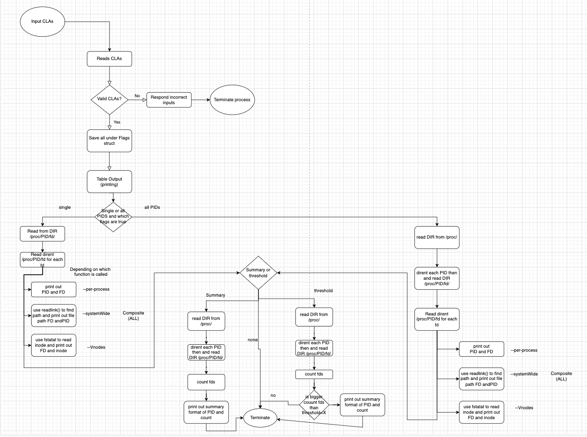
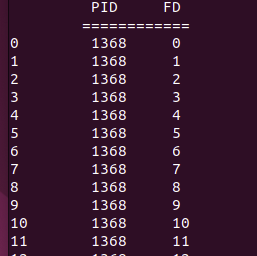
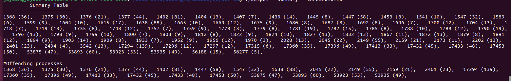

# Recreating the System-Wide FD Tables

# 1. Metadata:
Author: Jayden

Date: March 11, 2025

# 2. Introduction:
This is a simple C program that simply keeps track of open files, assignation of file descriptors, and process used by the OS.

# 3. Desiption of how you solve/approach the problem
I solved this my solving them sequentially. After all the setup of the flags and inputs (which was similar to A1) I started with per-process. I first had to do research on understanding the /proc/__/fd/ format. I played around in a linux system using ls -l /proc and such to visualize what I was actually doing. After that it was a matter of applying to what I saw. I used specific tools in C such as DIR and dirent to help navigate the directories and point to the items in the directory. After the per process it was pretty similar throughout where you have to either one set /proc/PID/fd/ to be a constant PID or a dynamic one where you iterate through, so the rest of the flags were similar in that manner.

# 4. Implementation
I implemented my code in modules, where each module (function) has a singular responsiblity (for the most part).
-  >int owns_file(char *PID)

This function tests to see if the current user has permission or access to the file and uses stat to test if PID exits.
-  >parse_args(Flags* f, int argc, char** argv)

This function takes in the arguments and saves their inputs in the Flags struct so it can be referenced later for printing and this uses DIR to read the directory path and test if PID leads to a valid directory path.
- >void per_process_output_single_PID(Flags* f, DIR *fd_path, struct dirent *fd_entry)

This function draws the content inside the table, it uses DIR to get to a directory and dirent to point at each item in the directory.
- >void per_process_output_multiple_PID(DIR* fd_path, DIR* proc_dir, struct dirent *fd_entry, struct dirent *entry)

This function outputs for the all running processes, it uses DIR and dirent to each directory of all PIDs and their /proc/PID/fd/ and it uses dirent to point at the PIDs in /proc and FDs in /proc/PID/fd/.
- >void system_Wide_output_single_PID(Flags* f,DIR* fd_path, struct dirent *fd_entry)

This function uses both DIR and dirent similar to per-process for a single PID however it includes
readlink to read the directory link.

- >void system_Wide_output_multiple_PID(DIR* fd_path, DIR* proc_dir, struct dirent *fd_entry, struct dirent *entry)

This function again uses both DIR and dirent in a similar fashion to per_process_output_multiple_PID but also uses readlink() to help extract the path of the current PID,FD.

- >void Vnodes_ouptput_single_PID(Flags* f,DIR* fd_path, struct dirent *fd_entry)

This function uses the DIR and dirent the same way as the previous but also uses fstatat to retrieve the metadata of the path, ultimately to find the inode of the fd.

- >void Vnodes_output_multiple_PID(DIR* fd_path, DIR* proc_dir, struct dirent *fd_entry, struct dirent *entry)

This function behaves similarily with the multiple_PID processes but also uses fstatat to extract the file metadata to get the inode.

- >void composite_output_single_PID(Flags* f,DIR* fd_path, struct dirent *fd_entry)

This behaves similar to all the combined single_PID outputs together and does not add any new feature or usage than the code prior to it.

- >void composite_output_multiple_PID(DIR* fd_path, DIR* proc_dir, struct dirent *fd_entry, struct dirent *entry)

This code again is similar to all the combined multiple_PID outputs together and has no new features within it.

- >void summary_output( DIR* fd_path, DIR* proc_dir, struct dirent *fd_entry, struct dirent *entry)

This function essentially goes to all PIDs and starts counting their FDs by reading each entry and prints it out.

- > void threshold_output(Flags* f,DIR* fd_path, DIR* proc_dir, struct dirent *fd_entry, struct dirent *entry)

This function does a similar job to the summary_output but before printing it has a check if the number of FDs is greater than the threshold=X, then it prints with it is **STRICTLY GREATER THAN X**.

- > void table_output(struct Flags* f)

This function just simply connects the pieces together, that being all the output function and it intializes the paths of /proc and the path of /proc/PID/fd if PID is given.

- > int main(int argc, char** argv)

This function just simply defines the Flags struct and calls functions parse_args and table_output.

# 5. Flow Chart

# 6. Compiling Code
To compile the code you should run:
> gcc -Werror -Wall -std=c99 -D_GNU_SOURCE  -o output a2.c

Note it is vital for -D_GNU_SOURCE because it allows readlink to work.

To run the code, there are optional flags and arguments:
> ./output [PID] [--per-process] [--systemWide] [--Vnodes] [--composite] [--summary] [--threshold=X]

Note it is mandatory if you want a specific PID then the PID must be the first argument.

All the other tags orders should not matter.

If no tag is present then it will default to composite.

The X in threshold should be an integer value, else it will exit or get truncated, and X is inclusive.

It is also important to note that --summary and --threshold=X are not affected by if there is a PID or not, regardless it will output for all PIDs.

# 7. Expected Results

This should be the expected output of --per-process and the other flags (excluding --summary and --threshold=X)should share a similar output of a table structured like this but with different lables.

This is the output of summary and threshold tags, it is represented by PID   (# of FDs).

>make

This will automatically run the redundant compile line:

>gcc -Werror -Wall -std=c99 -D_GNU_SOURCE  -o output a2.c

And to remove the ouptput file you can use

>make clean

This will get rid of the output file.

# 8. Test cases
A significant testcase I used was
>./output --per-process

Then I would take the last process of the PID table and use

>./output last_process --per-process

This will say that the process is unreachable because the last process of the first run no longer is a current process so it doesn't exists.

I also tested
>./output --per-process --Vnodes

This helped show if my DIR and dirent were resetting, and to show if it could read from multiple directories multiple times.

./output --systemWide --Vnodes

This also helped show if my DIR and dirent were resetting, and to show if it could read from multiple directories multiple times. This is different because of how the code is structured.

>./output --threshold=100000

This should show nothing in most cases.

>./output --threshold=25

This should show some cases

Obviously running all the flags independently is another few test cases as well.

# 9. Disclaimers

As stated previously with the testcases of the last test case of all PIDs from --per-process, the last PID does not work if you target it independently, this is presumed to be because it is no longer a process.

Another disclaimer is length of any specific FDs, PIDs (probably not PID) or such being too long, this will break the code and make the format off. It is most likely that your files and such will not surpass this limit though.

Another reminder that threshold=0 is invalid as a feature.

Code may fail if there are too many PIDs or if the file path is greater than 256 characters. It will also fail if the filename is greater than 1024. It depends on which part as systemWide is expected to hold larger strings than --per-process (/proc/PID/fd length less than 256).

# 10. References
https://stackoverflow.com/questions/52448530/stat-alternative-for-long-file-paths

https://linux.die.net/man/2/fstatat

https://www.gnu.org/software/libc/manual/html_node/Opening-a-Directory.html

https://pubs.opengroup.org/onlinepubs/7908799/xsh/dirent.h.html

https://pubs.opengroup.org/onlinepubs/009696699/functions/readlink.html
